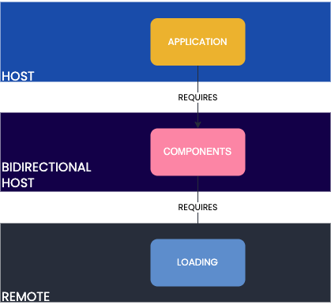

# Module federation example
This repository contains an example of module federation with three different packages, all managed using `pnpm` workspaces.

This is the scenario that has been realized:

We have a host called application, a bidirectional host called components and a remote called loading.

In plain english: firstly, the remote will expose a single loading component.  
Secondly, the bidirectional host will import the loading component, apply some CSS and then re-expose it. Additionally, it exposes a rounded button.  
Finally, the host will include these two components that will be shown to the user.
